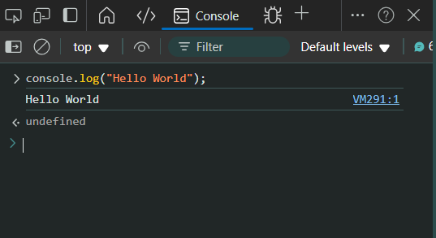

## JAVASCRIPT

A technology which we primarly use to create **_websites_**.


We mahorly have 3 parts for a website.

1. **HTML** - creates the content
2. **CSS** - gives the styles & appearance
3. **JavaScript** - makes the site interactive

### Requirements

- Web Browser (Chrome, Egde, Safari etc)
- Text Editor (VSCode, Sublime Text etc)

### Get-Started

To get started with JavaScript you can open `Developer Tools` by clicking `CTRL + SHIFT + I`, or more tools and then click on `Developer Tools`.

After opening the `Developer Tools` click on the `Console` and type the following.

```js
console.log("Hello World");
```

Click on `Enter` and you'll see something like this -


> Try running this `alert('Hello World');` : )

## Math in JS

To perform math in JS you can directly write your math expressions and then press enter ~

Try the following codes:

1. `2 + 2` - Addition
2. `10 - 8` - Subtraction
3. `3 - 4` - Multiplication
4. `10 / 4` - Division
5. `2 ** 3` - Exponent (a ^ b)


## <!-- Let's do something interesting -->

Let's try to do something with the website contents.

Try running the following code -

```js
document.body.innerHTML = "Hello, World!!";
```

**_You'll see the text "Hello, World!!" in the page._**

> To get back the original website you can just `Refresh` your webpage.
