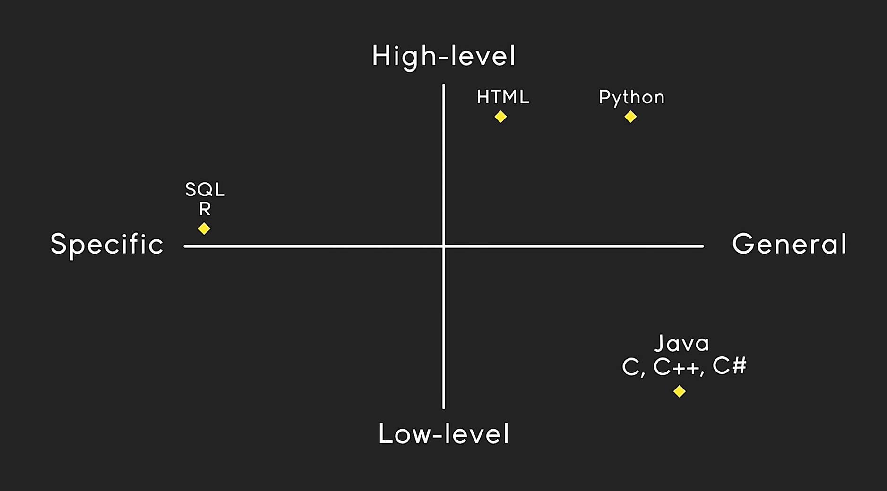

# Python

Python is a **high-level**, **interpreted** programming language known for its readability and simplicity.

- Created by **_Guido van Rossum_** and first released in **1991**, Python has a design philosophy that emphasizes code readability, notably using significant whitespace.
- It supports multiple programming paradigms, including _procedural, object-oriented, and functional programming_.



> These `general` and `abstract` languages are the best to get started with!!

## Key Features

- **Easy to Learn and Use**: Python's syntax is clear and concise, making it an excellent choice for beginners.
- **Versatile**: Python can be used for _web development, data analysis, artificial intelligence, scientific computing, and more_.
- **Extensive Libraries**: Python has a vast standard library and a large ecosystem of third-party packages.

## Installation Guide

### Windows

1. Download the latest Python installer from the [official Python website](https://www.python.org/downloads/windows/).
2. Run the installer and follow the on-screen instructions.
3. Make sure to check the box that says "Add Python to PATH" during the installation process.
4. Verify the installation by opening Command Prompt and typing:
   ```sh
   python --version
   ```

### macOS

1. Download the latest Python installer from the [official Python website](https://www.python.org/downloads/macos/).
2. Run the installer and follow the on-screen instructions.
3. Verify the installation by opening Terminal and typing:
   ```sh
   python3 --version
   ```

### Linux

1. Open Terminal.
2. Update the package list:
   ```sh
   sudo apt update
   ```
3. Install Python:
   ```sh
   sudo apt install python3
   ```
4. Verify the installation by typing:
   ```sh
   python3 --version
   ```

For more detailed instructions, refer to the [Python documentation](https://docs.python.org/3/using/index.html).

## Hello World Program

```python
# This is a simple Python program
print("Hello, World!")
```

For more information, visit the [official Python website](https://www.python.org/).
